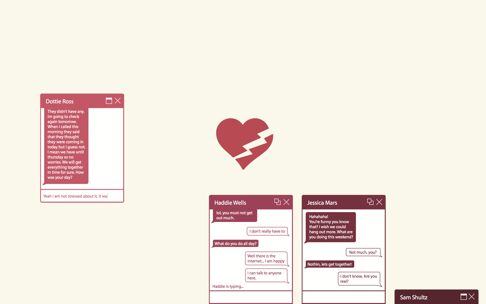
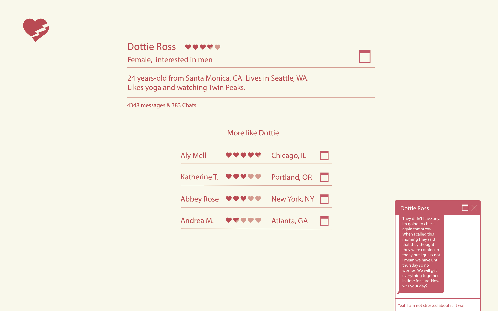

#Exes

I plan to create a web-application that allows visitors to chat with artificially-intelligent bots that are modeled after real life exes. The goal is to create a setting that promotes feelings of natural discourse through computer-mediated forms of communication (web-chat) while remaining transparent of the fact that none of the people the user is chatting with are actually real. The website, http://myex.es, will be modeled as a sort of cross between an online dating service and an anonymous chat application. While on the site visitors will be able to browse and find exes, initiate and participate in multiple chats at once, and receive messages from exes that initiate with them. 

Visitors will also be able to find “matches” by specifying personal information like age, sex, sexual orientation, residing city, and interests. By volunteering this information visitors will be paired with ex bots that can provide them with more satisfying and enjoyable conversations.

Each personalized ex bot that can be chatted with on the site will draw its message content from databases of personal messages submitted by users themselves. Visitors will easily be a able to submit their own personal data in the form of iMessage, facebook, and gmail chat logs. The site will use these personal messages to “train” a custom chatbot and that has the characteristics of a real-life ex taking into account things like tone, vocabulary, grammar, response rate (how long it takes someone to respond to a chat), etc… to represent that ex on the site. http://myex.es will use custom algorithms to ensure that user’s sensitive information remains secret as the custom ex bot does not directly respond with quotes from real chats. Instead each unique ex bot generates its messages based on content, language, and prior responses to similar message prompts.

Many of the themes that this project presents; ones of computer-mediated communication, online-dating and matched relationships, personalized artificial-intelligence, and even computer romance are more prominent than ever. There is no better time for interactive New Media art to play a participatory role in the evolution and exploration of these ideas and practices. While a romantically minded chat site where visitors communicate only with machine representations of real lovers may seem like a hyperbolic example of these tropes, I argue that these interactions are becoming more commonplace than one might think.

##Technical Stuff

The heavy lifting in this project will be almost entirely JavaScript. Basic client-side code will be handled by libraries like jQuery and possibly canvas manipulation with KineticJS. MongoDB will be used for storage and Node js for the custom artificial intelligence framework as well as basic server-side code. 

~~Bots will utilize Markov chains for generating personalized text based on prior messages.~~ Some open source attempts already exist which will speed up the process of developing a model to fit the projects needs (see [Cobe](https://github.com/pteichman/cobe) and [tripli-ng](https://github.com/spion/triplie-ng))

##Algorithm

Algorithm overview has been moved [here](https://github.com/brannondorsey/exchatter/blob/master/proposed_algorithm.md).

~~Note: The following proposed algorithm is written from the perspective of a human male communication with an artificially intelligent female. Humans of any sex will be able to conduct discourse with AIs of any sex.~~

~~1. Run [discourse analysis](http://en.wikipedia.org/wiki/Discourse_analysis) (DA) and [topic segmentation and recognition](http://en.wikipedia.org/wiki/Topic_segmentation) (TSR) on the input.
2. Run output from 1. against a database of all messages from the men that the ex bot has messaged to find similar prompts. Have a rating system that scores by similarity and use the girl's responses from the highest rated results as __source texts__.
3. Generate thousands of responses based on __source texts__. 70% of these responses should be taken from the woman's messages with her lover and 30% from her entire corpus. Use DA and TSR on the generated responses and select only the statements that fit the desired response type.
4. Order responses from 3 (somehow) and output the most appropriate one to the user.~~

##Themes

- Computer/Machine romance
- Computer-mediated communication between lovers
- Progression of relationships
- Reliving relationships through computer representations of old lovers

##Resources & Precedence

- [Her](http://www.imdb.com/title/tt1798709/) by Spike Jonze, 2013
- [Romance at Arms Length](http://www.nytimes.com/2014/02/09/sunday-review/romance-at-arms-length.html?_r=0), The New York Times, 2014
- [Even in Real Life, There Were Screens Between Us](http://www.nytimes.com/2011/05/01/fashion/01Modern.html?pagewanted=all&_r=0), Caitlin Dewey, 2011
- Chatbots and interactive artificial-intelligence since the 1960s (Cleverbot, Eliza, Cobe, etc...)

##Motivations

- Experiment in artificial intelligence
- Create a re-usable and open source framework for easily creating personalized chatbots using Node js
- Having a voice/playing an experimental role in the eminent move towards these themes in a rapidly changing technological relient society.

##Things to think about

- Message delays and frequency of follow up texts are personalized to each ex bot
- Ex's message lengths (in average words/characters) are also personalized.
- Clicking an ex's name in their chat window will bring up a profile that contains
	- name
	- Age
	- sex (m/f/t)
	- interests (m/f/t)
	- From location
	- Current location
	- List of other exes on the site paired with length of the relationship (maybe)
- How can the bots learn from use over time?
- How to best approach and handle fear of personal info leak from submitting data.
- Are there accounts? Hopefully not but how can the project be designed in a way that lets this happen.

	
	