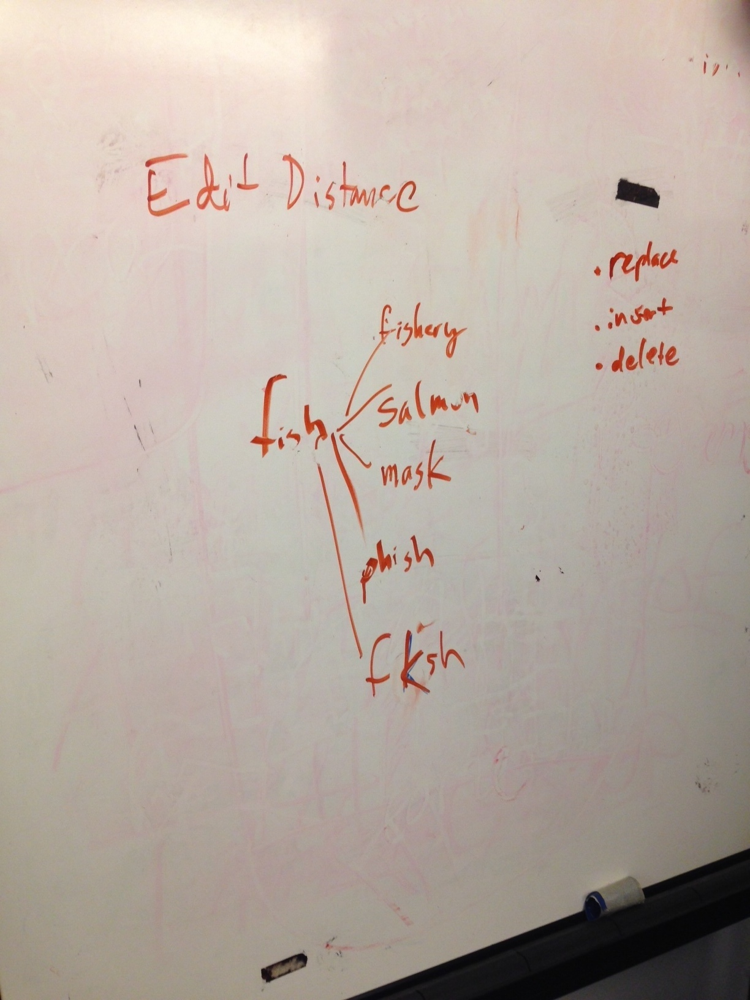
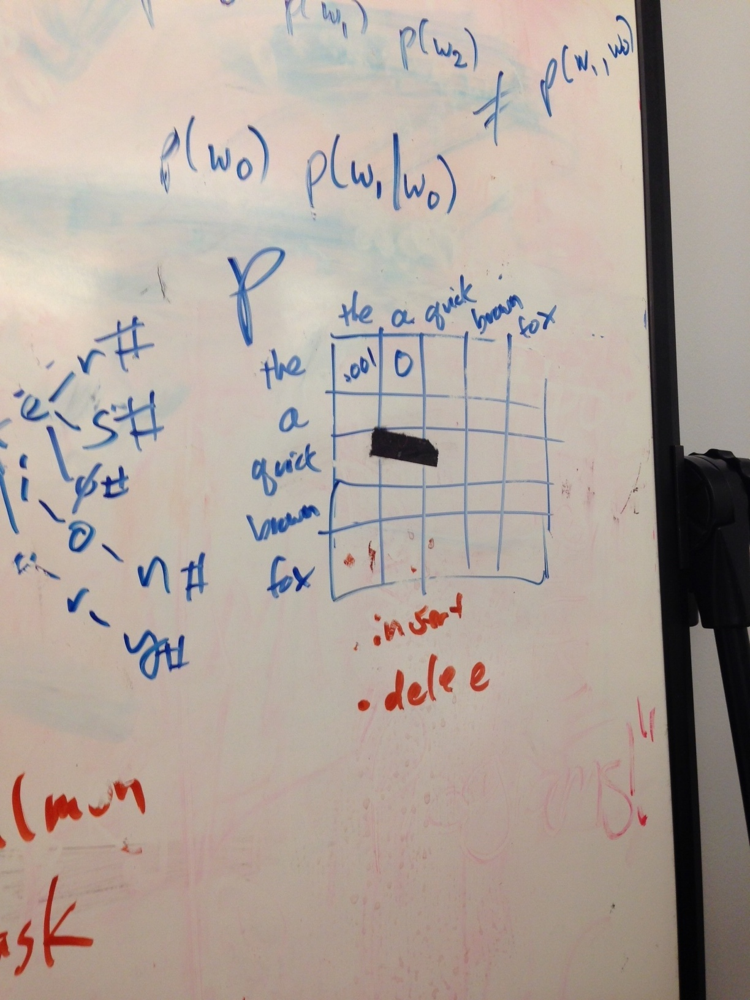

##More Thinking...
###Edit Distance
[Levenhtein distance](http://en.wikipedia.org/wiki/Levenshtein_distance) and [Jaro-Winkler distance](http://en.wikipedia.org/wiki/Jaro%E2%80%93Winkler_distance) are examples of an edit distance algorithm. For this algorithm you have two sequences (strings) and a cost matrix for (inserting, deleting, and replacing).

- replace
- insert
- delete

Existing cost matrixes can be used to test for different things. For instance a "qwerty" keyboard cost matrix would place a low cost on the replacement of the letter "o" for "p" in "lpst" (trying to say "lost") because the two letters are near each other on a keyboard.

- I need to create a spelling fixes database for each message in corpus
- I need to create an n-gram table (2D array) for generating an LM using bigrams. Perhaps have two n-gram tables, one for generating positive utterances and one for generating negative utterances. Maybe even generate a unigram, bigram, and trigram response and create a weighted average of all three.

David is hoping that I will eventually run out of data. With unlimited data there is no machine learning involved.

###Language Model

Language model (LM) isn't a specific technique but rather a model which produces a well formed string of some class of language. A chatbot is a language model. Language models gives a probabilistic response.

- Generative LM (you push a button and it will make an utterance in that language)
- Discriminative LM (another kind that David never explained)

Make a trie or table of every possible sequence of words from a corpus.

###Trie
A Trie is a memory efficient data structure that uses a tree to represent all words (or utterances) in a data set. It saves space because it doesn't resave the same letters (i.e. "let" and "letter" aren't both saved, but rather "let" is saved and then "letter" saves "ter" and a reference to "let")

Can take a weighted average of unigram, bigram, trigrams.

Im going to make a language model based on all responses to positive prompts. Then I have a positive utterances table and a negative utterances table.

###Create ex-specific parameter list

- Know how these parameters should be represented in http://myex.es so I can create tweak able framework

Framework needs to be able to identify positive or negative utterances (how?)

I am building a discourse model. This is stronger than a language model.

Nearest-neighbor classification technique is what I am using now.

Most important question is how I will model the discourse. This is solved with basic __human__ intelligence. How would I come up with simple rules to model a believable discourse? I need to look at examples of real discourse and come up with rules that can create it (in an ideal world). Then pick algorithms/methods/techniques that get close enough.

When reading chat logs I need to be saying "oh look they used a synonym here, oh look they changed the word order here, oh look they paraphrased". How often does my large set of chat logs satisfies my needs here? How often do I need an external resource. How often do I need a language model.

- Stay at the really high level human reasoning level.

- The best programmers he knew spent a week thinking about the problem, the bad ones started coding right away...

- High-level abstraction in code allows us to tackle problems with creative wide-minded thinking rather than technical expertise

